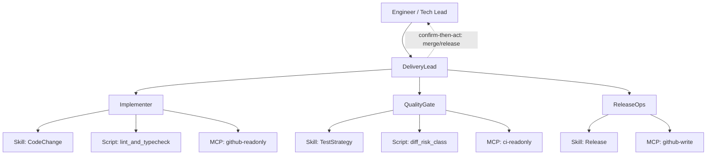

# Example Blueprint — Software Delivery Team

Illustrative **Approved-shaped** package for a mid-size product engineering org. Not a mandate—shows EMAAD output density.

| Field | Value |
|-------|-------|
| Slug | software-dev-team |
| Status | Review (example) |
| Pattern | **Subagents** + Skills inside specialists |
| Date | 2026-09-06 |

## Mission

Accelerate software delivery with an agent ecosystem that plans work, implements changes in sandboxes, runs deterministic quality gates, and requires humans for production merges and customer-facing communications.

## Tradeoff statement

> We choose **Subagents** because domain packs (codebase navigation, test strategy, release ops) are large and owned by different platform groups, accepting **one extra model hop** through the supervisor for centralized control and context isolation.

## Binding constraints

- context_pressure: true  
- distributed_ownership: true  
- parallel_isolation: true  
- central_workflow_control: true  
- direct_specialist_ux: false (users talk to DeliveryLead only)

## Ecosystem

## Agents

| Agent | SRP mandate | User-facing | Skills | MCP |
|-------|-------------|-------------|--------|-----|
| DeliveryLead | Coordinate delivery tasks, delegate to specialists, present plans/risks to humans | yes | orchestration snippets only | none |
| Implementer | Produce code changes in feature branches per accepted plan | no | CodeChange | github-readonly |
| QualityGate | Run and interpret quality signals; classify merge risk | no | TestStrategy | ci-readonly |
| ReleaseOps | Prepare release notes and execute approved release steps | no | Release | github-write |

### DeliveryLead mandate

> Coordinate software delivery by decomposing requests, calling specialists, and returning a single plan/result package to the human.

### Implementer mandate

> Implement the accepted change set in a branch using CodeChange workflows and readonly repo context.

### QualityGate mandate

> Assess whether the change meets quality bars using tests, CI signals, and deterministic risk scripts.

### ReleaseOps mandate

> Prepare and execute release actions only after human confirm-then-act approval.

## Skills (summary)

| Skill | Workflows | Risk | Bundle |
|-------|-----------|------|--------|
| CodeChange | PlanEdit, ApplyPatch, OpenPR | High (scripts+git) | engineering |
| TestStrategy | SelectTests, TriageFailures | Medium | engineering |
| Release | DraftNotes, CutRelease | High (write MCP) | platform |

## Scripts

| Script | Purpose |
|--------|---------|
| `lint_and_typecheck` | Deterministic local quality gate |
| `diff_risk_class` | Classify diff size/paths into risk tier for HITL |
| `validate_pr_template` | Ensure PR body required sections exist |

## MCP allowlist (summary)

| Server | Scopes | Agents |
|--------|--------|--------|
| github-readonly | read code/PRs | Implementer, QualityGate |
| github-write | write PRs/releases | ReleaseOps only |
| ci-readonly | read check runs | QualityGate |

OWASP highlights: split read/write (MCP02), pin servers (MCP03/04), audit tool calls (MCP08), deny ad-hoc MCP (MCP09), specialists get task briefs not full org chat (MCP10).

## HITL

| Action | Class | Approver |
|--------|-------|----------|
| Merge to main / tag release | confirm-then-act | Tech Lead |
| Open draft PR | act-then-audit | — |
| Lint/typecheck | autonomous | — |
| Customer status email | human-only | Account owner |

## Token strategy

- Specialists load only their skill pack  
- Lead keeps lean routing policy  
- Large repo knowledge via readonly MCP + search, not paste-entire-monorepo  

## Implementation backlog

1. Author skill directories under org skills git  
2. Wire MCP allowlist in agent runtime  
3. Add eval suites (3–5 queries per skill)  
4. Connect audit logs to SIEM  
5. Pilot on one service team for two sprints  

## Checklist results (example)

| Checklist | Result |
|-----------|--------|
| SRP | Pass |
| Security | Pass with waiver: MCP03 schema pinning within 30 days — owner Platform Sec |
| Tokens | Pass |
| HITL | Pass |
