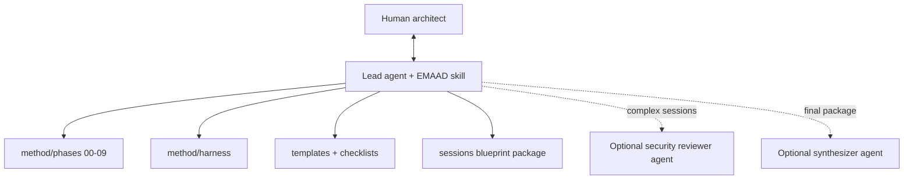

# Implementation Plan: EMAAD Designer

**Branch**: `001-architecture-designer`  
**Date**: 2026-09-06  
**Spec**: [spec.md](./spec.md)

## Summary

Build EMAAD as a **Markdown-native, conversation-executed method** (SDD). No application server. The "implementation" is: constitution, phased interview, decision matrices, security harness, templates, checklists, a designer skill, optional designer agents, and a worked example. Coding agents execute the method; humans decide.

## Technical Context

| Dimension | Choice |
|-----------|--------|
| **Primary language** | Markdown (method + templates) |
| **Execution runtime** | Any capable coding/agent IDE (Cursor, Claude Code, etc.) |
| **Optional helpers** | Later: small validators (Python/Node) for checklist completeness—out of P1 scope |
| **Storage** | Git; session outputs in `sessions/` (gitignored) or user-chosen path |
| **Dependencies** | None required to run the method |
| **Target platform** | Tool-agnostic agent ecosystems |
| **Performance goal** | Minimize interview turns while maximizing decision quality |
| **Constraints** | Constitution-binding; security gates before Approved |
| **Scale** | From solo builders to enterprise role-bundled skill catalogs |

## Constitution Check

| Principle | Plan compliance |
|-----------|-----------------|
| SDD product | Spec + method + skill are the deliverable |
| Start simple | Decision tree defaults to single-agent |
| SRP | Dedicated checklist + card fields |
| Taxonomy | Explicit primitive docs + templates |
| Tokens | Token phase + checklist |
| HITL | Dedicated phase + checklist |
| Security harness | Full harness docs + gate blocking Approved |
| Portability | Markdown-first, no lock-in |

**Gate status**: Pass — proceed.

## Architecture (of EMAAD itself)

EMAAD uses a **Skills-first** pattern for the designer product (meta):

- One lead conversational agent loads `skills/emaad-designer`
- Progressive disclosure into method phases and harness references
- Optional specialist agents (`agents/`) for security review and synthesis on large sessions—**subagents pattern**, invoked only when useful

This mirrors the guidance we teach: don't multi-agent the designer unless session complexity demands isolation.



## Project Structure

```text
emaad/
├── constitution.md
├── README.md
├── CONTRIBUTING.md
├── specs/001-architecture-designer/
│   ├── spec.md
│   ├── plan.md
│   ├── research.md
│   └── tasks.md
├── method/
│   ├── README.md
│   ├── interview-protocol.md
│   ├── architecture-decision.md
│   ├── primitive-taxonomy.md
│   ├── srp-and-boundaries.md
│   ├── token-optimization.md
│   ├── human-in-the-loop.md
│   ├── harness/
│   └── phases/
├── templates/
├── checklists/
├── skills/emaad-designer/
├── agents/
└── examples/
```

**Structure decision**: Spec Kit–aligned `specs/` plus a first-class `method/` tree because the method *is* the runtime.

## Implementation approach

1. Author binding constitution and public README  
2. Author SDD spec/plan/research/tasks  
3. Author method spine (taxonomy, decisions, HITL, tokens, SRP)  
4. Author phased interview scripts  
5. Author security harness mapped to OWASP MCP + Skills enterprise vetting  
6. Author templates + checklists  
7. Author designer skill (entry point) + optional agents  
8. Author one full software-dev example blueprint  
9. Author CONTRIBUTING  

## Risks & mitigations

| Risk | Mitigation |
|------|------------|
| Method too long / interview fatigue | Phase skip rules when answers already known; batch questions |
| Over-prescriptive for non-dev domains | Domain-neutral wording; software example is illustrative |
| OWASP MCP still beta | Cite version; allow Accepted-risk with owner |
| Users want code generators immediately | Keep P1 method-complete; optional validators later |

## Next

Execute `tasks.md` to materialize remaining artifacts (this plan's checklist).
