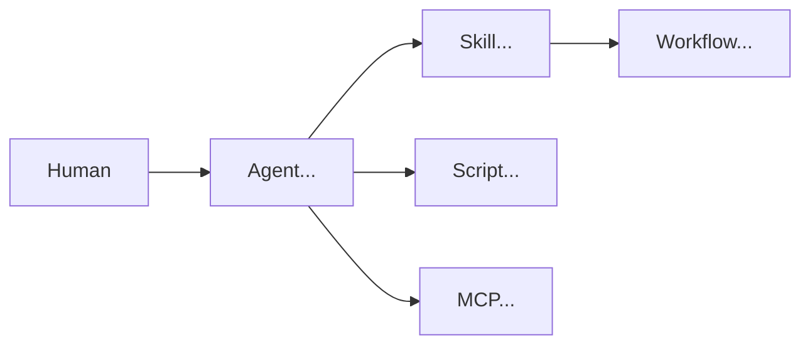

# Architecture Blueprint — {{project_name}}

| Field | Value |
|-------|-------|
| Slug | {{project_slug}} |
| Status | Draft \| Review \| Approved \| Draft / Security Incomplete |
| Date | {{date}} |
| Designer session | |
| Accepted by | _(required for Approved)_ |

## 1. Mission

{{mission}}

## 2. Primary pattern

**EMAAD pattern:** {{primary_pattern}}

**GCP pattern:** {{gcp_pattern}}  
([reference](https://docs.cloud.google.com/architecture/choose-design-pattern-agentic-ai-system))

**Tradeoff statement:** {{tradeoff_statement}}

**GCP requirements (A–E):** 

**Binding constraints:** 

**Rejected alternatives:** 

**Secondary patterns (if any):** 

**Primitive selection rationale:** 

## 3. Ecosystem overview

## 4. Agents

| Agent | SRP mandate | User-facing | Skills | MCP/tools |
|-------|-------------|-------------|--------|-----------|
| | | | | |

Details: `agents/`

## 5. Skills & workflows

| Skill | Domain | Workflows | Bundle | Risk tier |
|-------|--------|-----------|--------|-----------|
| | | | | |

## 6. Scripts

| Script | Purpose | Invoked by | I/O |
|--------|---------|------------|-----|
| | | | |

## 7. MCP allowlist

See `mcp-allowlist.md`. Summary: 

## 8. Security harness

- Secrets: 
- Audit: 
- Sandbox: 
- Skill version pin: 
- OWASP MCP coverage: Complete / Waivers  

## 9. HITL map

| Action | Class | Approver | Evidence |
|--------|-------|----------|----------|
| | | | |

## 10. Token strategy

- Progressive disclosure: 
- Bundles: 
- Isolation rationale: 

## 11. Implementation backlog

1. 
2. 
3. 

## 12. Waivers

_None_ | see list

## 13. Checklist results

| Checklist | Result |
|-----------|--------|
| SRP | |
| Security | |
| Tokens | |
| HITL | |
